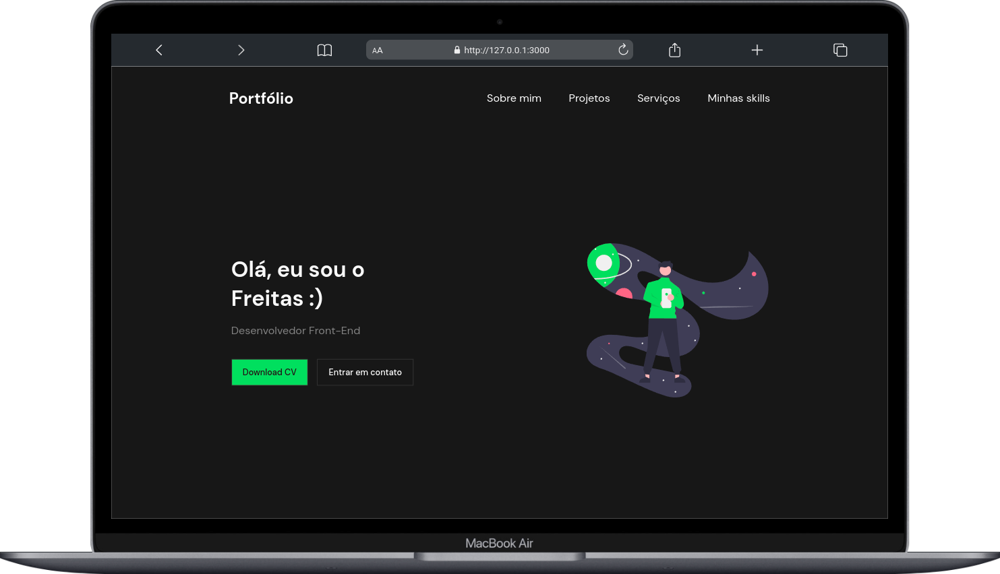
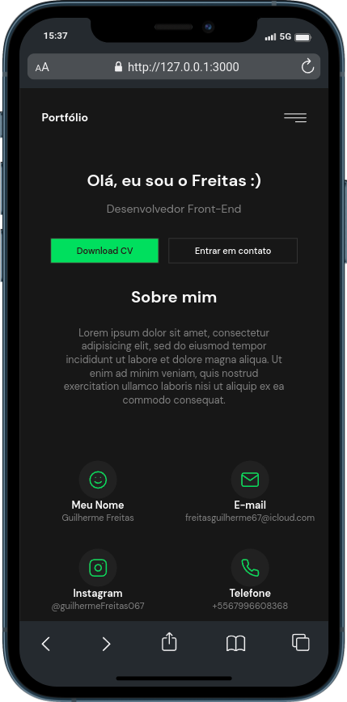

# Fictice Portfolio Project 🚀 EN
## https://codelandia-portfolio.vercel.app/
I'm very excited to share my new project with you! 😃 This project was created as a way to showcase and practice my skills in HTML, CSS, and JavaScript.

  

    
<b>🖥️ Desktop</b>

    
  

  

    
<b>📱 Mobile</b>

    
  

## How to use 🤔

1. Download or clone the repository to your local machine.
2. Open the index.html file in your internet browser.
3. Explore the website and have fun! 😊

If you have any questions, comments or suggestions, feel free to contact me. I'm always looking to improve and would appreciate your constructive feedback. 🙏

---
*The design of this project is based on the "Portfolio project" challenge from the Codelândia community, created by Iuri Silva. 🎨*

⠀⠀⠀⠀⠀

# Projeto porfolio ficticio 🚀 PT-BR

Estou muito animado em compartilhar meu novo projeto para vocês! 😃 Este projeto foi criado como uma forma de demonstrar e treinar minhas habilidades em HTML, CSS e JavaScript.

## Como utilizar 🤔

1. Faça o download ou clone o repositório em sua máquina local.
2. Abra o arquivo index.html em seu navegador de internet.
3. Explore o site e conheça um pouco mais sobre mim e meus trabalhos! 😊

Se você tiver alguma dúvida, comentário ou sugestão, sinta-se à vontade para entrar em contato comigo. Estou sempre procurando melhorar e agradeceria o seu feedback construtivo. 🙏 .

---
*O design deste projeto é baseado no desafio "Projeto Portfólio" da comunidade Codelândia, criada por Iuri Silva. 🎨*
